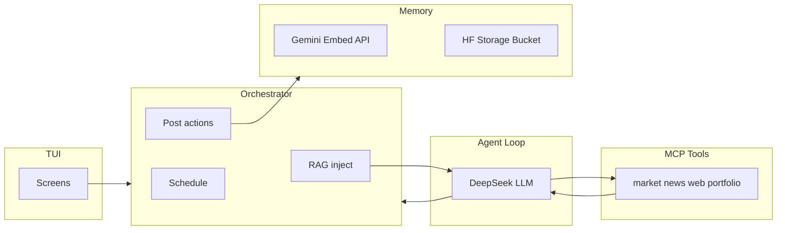

# Architecture

High-level design for **BotyTrader**: TUI → Orchestrator → Agent Loop + Executor, with MCP tools and a layered memory system.

## System diagram

```
┌─────────────────────────────────────────────────────────────┐
│                        TUI (Ink)                             │
│  [Dashboard] [Watchlist] [Agent Log] [Memory] [Config]       │
└─────────────┬───────────────────────────────────────────────┘
              │ renders state, receives commands
┌─────────────▼───────────────────────────────────────────────┐
│                      Orchestrator                            │
│  - manages watchlist symbols                                 │
│  - fires agent cycles on schedule                            │
│  - routes decisions to executor                              │
└──────┬──────────────────────┬───────────────────────────────┘
       │                      │
┌──────▼──────┐     ┌─────────▼──────────────────────────────┐
│  Executor   │     │           Agent Loop                    │
│  Broker     │     │  1. recall memory                       │
│  (Alpaca /  │     │  2. build context + system prompt       │
│   etc.)     │     │  3. DeepSeek LLM with tools             │
│  submit     │     │  4. tool calls until confident          │
│  orders     │     │  5. emit structured decision            │
└─────────────┘     │  6. store memory → push to HF           │
                    └─────────────────────────────────────────┘
                              │ tool calls
          ┌───────────────────┼──────────────────────┐
          │                   │                      │
┌─────────▼──────┐  ┌─────────▼──────┐  ┌──────────▼───────┐
│  market.ts     │  │   news.ts      │  │   web_search.ts  │
│  OHLCV + tech  │  │  Alpaca News / │  │   Brave API      │
│  indicators    │  │  NewsAPI       │  │  general intel   │
└────────────────┘  └────────────────┘  └──────────────────┘
          │
┌─────────▼──────────────────────────────────────────────────┐
│                     Memory System                           │
│  embedder.ts  →  Gemini Embedding API (text-embedding-004) │
│  store.ts     →  Hugging Face Storage Buckets (S3-compat.) │
│  hf.ts        →  bucket read/write helpers + auth          │
└──────────────────────────────────────────────────────────────┘
```

## Two-model split

| Role | Purpose | Choice |
|------|---------|--------|
| **Embedding model** | Turn text into vectors for storage and retrieval | Gemini Embedding API — e.g. `text-embedding-004` (requires `GEMINI_API_KEY`) |
| **LLM** | Reason over retrieved context + tool results | DeepSeek API (requires `DEEPSEEK_API_KEY`) |

## Component responsibilities

| Component | Responsibility |
|-----------|----------------|
| **TUI** | Render orchestrator/agent/memory state; send user commands (config, manual triggers). |
| **Orchestrator** | Watchlist; schedule agent cycles; open MCP/LLM session; apply **post-decision** actions (orders, memory sync). |
| **Agent loop** | RAG-backed system prompt; call MCP tools during reasoning; emit **structured decision JSON** (not a tool). |
| **Executor / broker** | Submit orders via the selected **broker adapter** (paper or live as configured). |
| **MCP tools** | `market`, `news`, `web_search`, `portfolio` — invoked **only by the agent** during reasoning. |
| **Actions (non-tools)** | `submit_order`, `summarize_to_memory` — invoked by the **orchestrator** after a decision, not exposed as agent tools. |
| **Memory** | Embed via Gemini API → store/retrieve from Hugging Face Storage Buckets for RAG. |

## Data flow (one cycle)

1. **Startup (optional):** Warm caches or verify HF Storage Bucket connectivity.
2. **Cycle start:** Embed query context (via Gemini API) → vector similarity search in HF Storage Bucket → retrieve top-k memories → inject into system prompt (automatic RAG, not a tool call).
3. **Reasoning:** LLM ↔ MCP tools until the model produces a final **decision** (no further tool calls for that step).
4. **Decision:** Orchestrator parses structured JSON `{ action, qty, reasoning, confidence, ... }`.
5. **Execution:** If auto-trade and policy allow → broker `submitOrder`.
6. **Memory:** `summarize_to_memory(cycleData)` → embed via Gemini → write to HF Storage Bucket.



## Source tree layout (intended)

The main app package (`tradr/`) and optional standalone MCP package (`tradr-mcp/`) follow this structure.

### `tradr/` (application)

```
tradr/
├── src/
│   ├── agent/
│   │   └── loop.ts              ← agentic cycle
│   ├── execution/
│   │   ├── broker.ts            ← BrokerAdapter interface
│   │   ├── exit_monitor.ts      ← stop-loss / take-profit loop
│   │   └── adapters/
│   │       ├── alpaca.ts
│   │       ├── coinbase.ts
│   │       └── binance.ts
│   ├── mcp/
│   │   ├── server.ts            ← MCP server
│   │   └── tools/
│   │       ├── web_search.ts    ← Brave
│   │       ├── market.ts        ← OHLCV + indicators (via broker adapter)
│   │       ├── news.ts
│   │       └── portfolio.ts     ← (via broker adapter)
│   ├── memory/
│   │   ├── embedder.ts          ← Gemini Embedding API client
│   │   ├── store.ts             ← vector index read/write (HF Storage Bucket)
│   │   └── hf.ts                ← bucket auth + upload/download helpers
│   ├── actions/
│   │   ├── alpaca.ts            ← submitOrder (via broker adapter)
│   │   └── memory.ts            ← summarizeToMemory
│   ├── signal/
│   │   └── technical.ts         ← SMA, RSI
│   ├── config.ts                ← load/save config.toml
│   ├── tui/
│   │   ├── app.tsx
│   │   └── screens/
│   │       ├── Dashboard.tsx
│   │       ├── AgentLog.tsx
│   │       ├── Memory.tsx
│   │       ├── Portfolio.tsx
│   │       └── Config.tsx
│   └── index.ts                 ← startup sequence
├── .env
└── package.json
```

### `tradr-mcp/` (standalone MCP server, optional)

```
tradr-mcp/
├── src/
│   ├── server.ts                ← MCP server entry point
│   ├── tools/
│   │   ├── web_search.ts
│   │   ├── market.ts
│   │   ├── news.ts
│   │   ├── portfolio.ts
│   │   └── index.ts             ← tool registry
│   ├── actions/                 ← NOT MCP tools — orchestrator only
│   │   ├── alpaca.ts
│   │   └── memory.ts
│   └── memory/
│       ├── embedder.ts          ← Gemini Embedding API client
│       ├── store.ts             ← vector index read/write (HF Storage Bucket)
│       └── hf.ts                ← HF bucket auth + upload/download helpers
├── package.json
└── tsconfig.json
```

When MCP runs in-process inside `tradr`, the same logical modules apply; `tradr-mcp` is the split-out variant for separate deployment or testing.

## Related docs

- [Agent cycle](agent-cycle.md) — detailed steps and tool contracts.
- [Memory](memory.md) — embedder, store, Hugging Face.
- [Configuration](configuration.md) — `config.toml` and secrets.
